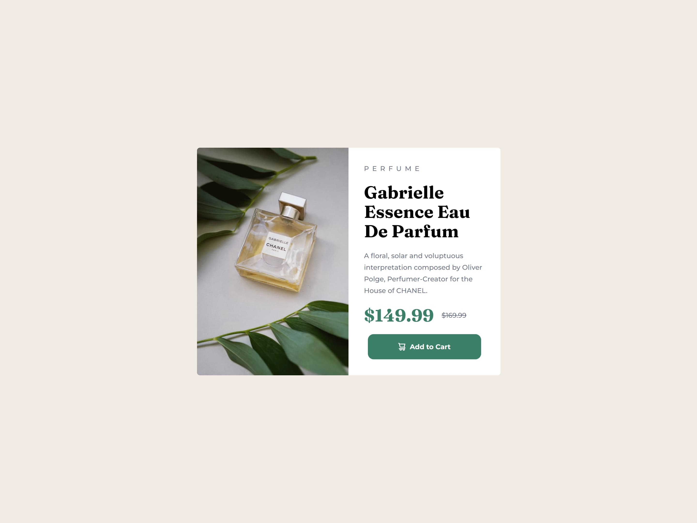
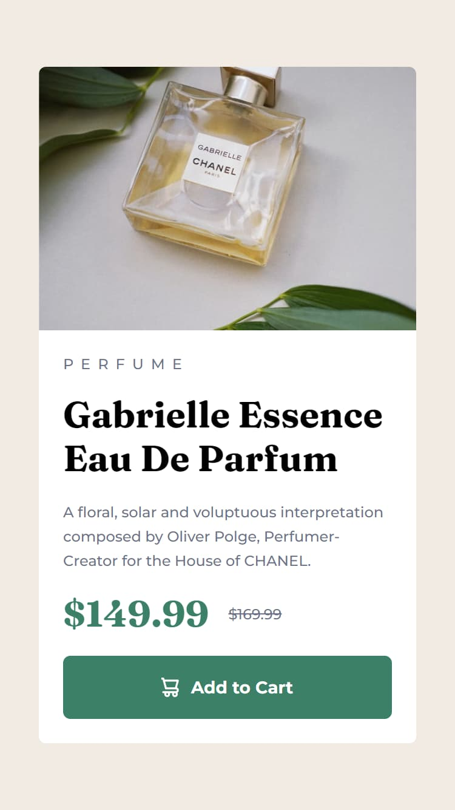

# Frontend Mentor - Product preview card component solution

This is a solution to the [Product preview card component challenge on Frontend Mentor](https://www.frontendmentor.io/challenges/product-preview-card-component-GO7UmttRfa). Frontend Mentor challenges help you improve your coding skills by building realistic projects. 

## Table of contents

- [Overview](#overview)
  - [The challenge](#the-challenge)
  - [Screenshot](#screenshot)
  - [Links](#links)
- [My process](#my-process)
  - [Built with](#built-with)
  - [What I learned](#what-i-learned)
- [Author](#author)

## Overview

### The challenge

Users should be able to:

- View the optimal layout depending on their device's screen size
- See hover and focus states for interactive elements

### Screenshot




### Links

- Solution URL: [Add solution URL here](https://your-solution-url.com)
- Live Site URL: [Add live site URL here](https://your-live-site-url.com)

## My process

### Built with

- Semantic HTML5 markup
- CSS custom properties
- Flexbox
- Mobile-first workflow
- [React](https://reactjs.org/) - JS library
- [Tailwind CSS](https://tailwindcss.com/) - CSS framework
- [Vite](https://vitejs.dev/) - Build tool
- [Google Fonts](https://fonts.google.com) - Online fonts
- [Netlify](https://www.netlify.com/) - For deploy

### What I learned

I learned to custom the styles needed for this project in the **tailwind.config.js**: creating animations, extending vanilla styles, creating variables to use, etc.

```js
{...
  theme: {
      extend: {
        animation: {
          'appear': 'appear 1s'
        },
        keyframes: {
          'appear': {
            '0%': { opacity: 0, transform: 'translateY(20px)' },
            '100%': { opacity: 1, transform: 'translateY(0px)' }
          }
        },
        width: {
          'md': '627px'
        }
      },
      fontFamily: {
        'title': ['Fraunces', 'serif'],
        'body': ['Montserrat', 'sans-serif']
      },
      colors: {
        'cyan': {
          DEFAULT: 'hsl(158, 36%, 37%)',
          'hover': 'hsl(158, 36%, 20%)',
          'active': 'hsl(158, 36%, 10%)'
        },
        'cream': 'hsl(30, 38%, 92%)',
        'title': 'hsl(212, 21%, 14%)',
        'body': 'hsl(228, 12%, 48%)',
        'white': 'hsl(0, 0%, 100%)'
      },
      letterSpacing: {
        'ultra': '0.5em'
      }
...}
```

## Author

- Frontend Mentor - [@tomascarrizodev](https://www.frontendmentor.io/profile/tomascarrizodev)
- LinkedIn - [Tomas Carrizo](https://www.linkedin.com/in/tomascarrizodev)